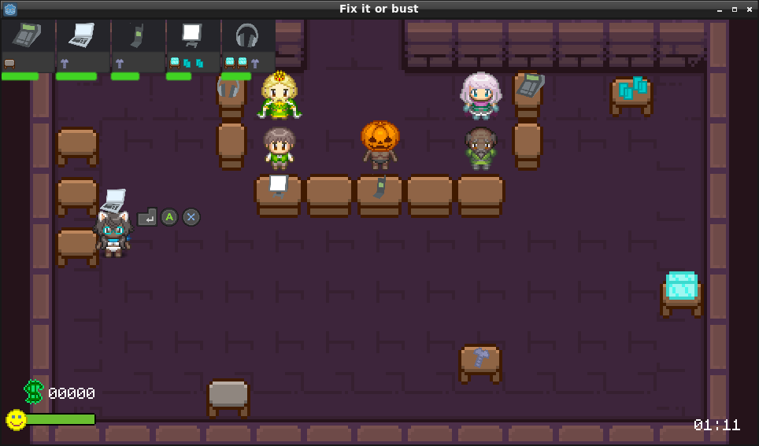

# ggj2020
A Global Game Jam project



play the game -> https://progsource.github.io/ggj2020/


## Ideas

* Village repair
  * repair multiple houses to get more villagers
* Machine repair
  * Urbz like job
* Relationship repair
  * too much text needed
* Bug hunting in code project
* Human repair
* **Overcooked repair shop**

## Game Loop

* Player presses start button
* level timer starts
* 1 NPC arrives at desk
* NPC puts down item on desk
* item is added to task list with requirements - color a background
* Player picks up item
* player picks required items
* player goes to working area
* player presses button to assemble items
* player goes back to desk and returns item
* player receives money and happiness based on time

* when the level timer runs out - highscore screen incl. start next level button

## Assets

* game/assets/img/pipoya -> https://pipoya.itch.io/pipoya-free-rpg-character-sprites-32x32
  ```
  License
  - For commercial or personal use.
  - Use and edit freely.
  - Not for redistribution or resale as an asset.
  - It can be used for game development and other productions.
  ```
* game/assets/img/dungeon_pack -> https://pixel-poem.itch.io/dungeon-assetpuck

* game/assets/audio/504885__selcukartut__nature-sounds-quiet-environment -> https://freesound.org/people/selcukartut/sounds/504885/
* game/assets/audo/332310__sirderf__group-of-people-screaming-aribaaaa-outside-02.wav -> https://freesound.org/people/Sirderf/sounds/332310/
* game/assets/audo/336998__tim-kahn__awww-01.wav -> https://freesound.org/people/tim.kahn/sounds/336998/
* game/assets/audo/437645__dersuperanton__crowd-wow-surprise-people.wav -> https://freesound.org/people/dersuperanton/sounds/437645/
* game/assets/audo/422651__trullilulli__sfx-player-action-phone-pick-up.wav -> https://freesound.org/people/trullilulli/sounds/422651/
* game/assets/audo/361564__matthewwong__ding-dong.wav -> https://freesound.org/people/MatthewWong/sounds/361564/
*  game/assets/audo/81098__lg__electric-screwdriver-04.wav -> https://freesound.org/people/LG/sounds/81098/
* game/assets/audo/131364__kaonaya__washing-machine-1.wav -> https://freesound.org/people/kaonaya/sounds/131364/
* game/assets/audio/472638__loberg77__welding.wav -> https://freesound.org/people/loberg77/sounds/472638/
## For later reading pleasure

 - https://www.gdquest.com/tutorial/game-design/godot/30-days-free-game-creation-tutorial/
